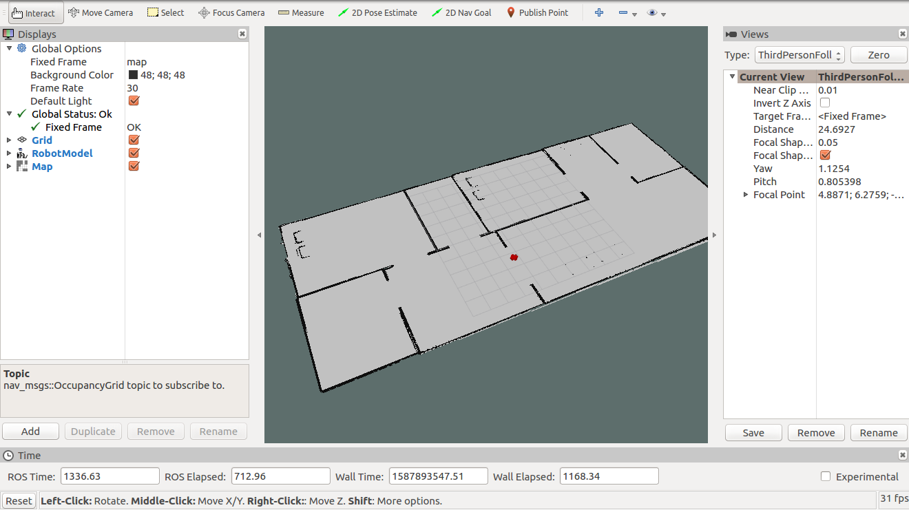
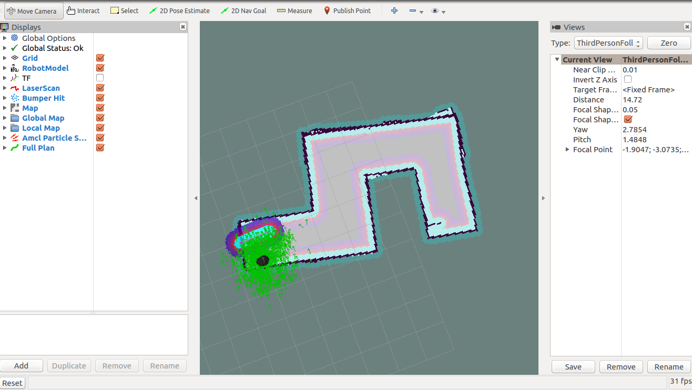
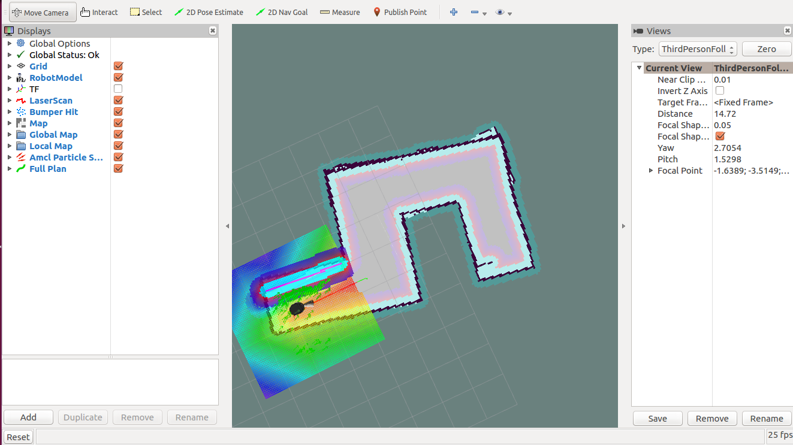
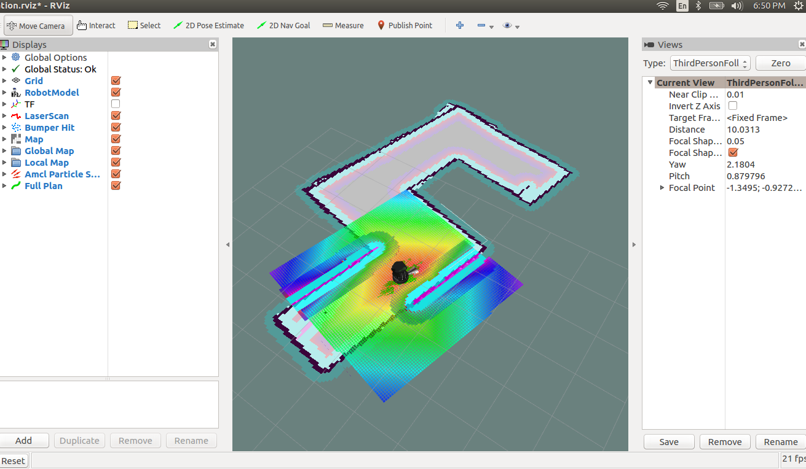
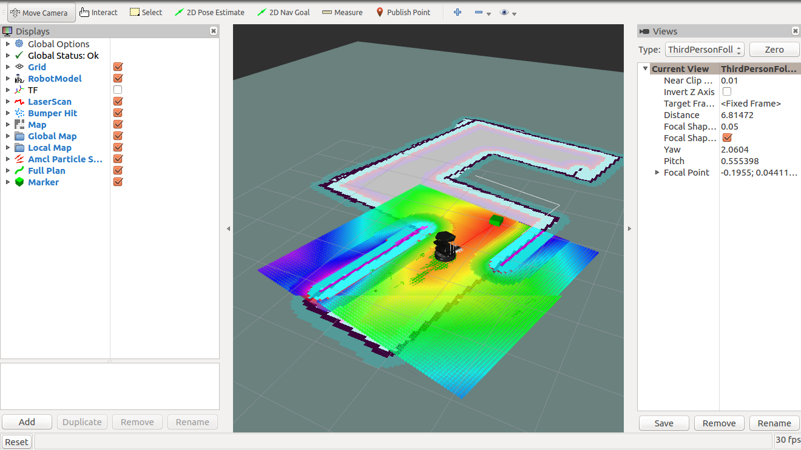

# Home_service_robot_simulation
Home service robot which can do - Autonomous navigation with pick and place of objects using turtlebot robot

## Steps to Launch:
### step 1 create the catkin_ws
```
$ mkdir -p /home/workspace/catkin_ws/src
$ cd /home/workspace/catkin_ws/src
$ catkin_init_workspace
$ cd ..
$ catkin_make
```

### Step 2 Perform a System Update/Upgrade
```
$ apt-get update
$ apt-get upgrade -y
```
### Step 3 Clone the Package in src
```
$ cd /home/workspace/catkin_ws/src
$ git clone https://github.com/mahendraseervi/Home_service_robot_simulation.git
```
### Step 4 Build the Packages
```
$ catkin_make
$ source devel/setup.bash
```
### Step 5 run the shell script
```
$ cd /home/workspace/catkin_ws/src
$ ./home_service.sh 
```
This will launch multiple roslaunch files for the autonomous navigation with pick and place of objects.

## Images :
## 2D map creating using gmapping:
```
$ cd /home/workspace/catkin_ws/src
$ ./test_slam.sh
```


## Localization of the robot:


## Ros navigation test:
```
$ cd /home/workspace/catkin_ws/src
$ ./test_navigation.sh
```


## Going to multiple location autonomously with single script:
```
$ cd /home/workspace/catkin_ws/src
$ ./pick_objects.sh
```


## Pick and place of the object with autonomous navigation:
```
$ cd /home/workspace/catkin_ws/src
$ ./home_service.sh
```



